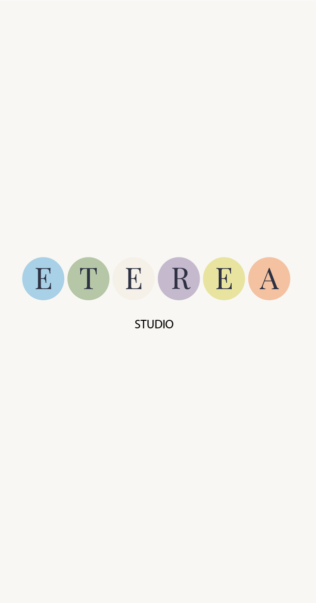

<div align="center">



# 🎨 Eterea Gestionale

**Sistema di Gestione Aziendale (ERP) per Studio Creativo**

[](https://gestionale.etereastudio.it)
[](https://php.net)
[](https://mysql.com)
[](https://tailwindcss.com)
[](LICENSE)

[🌐 Accedi al Gestionale](https://gestionale.etereastudio.it) · [📧 Contatti](mailto:info@etereastudio.it)

</div>

---

## 📋 Indice

- [Panoramica](#-panoramica)
- [Funzionalità](#-funzionalità)
- [Stack Tecnologico](#-stack-tecnologico)
- [Installazione](#-installazione)
- [Configurazione](#-configurazione)
- [Utilizzo](#-utilizzo)
- [Sicurezza](#-sicurezza)
- [Deployment](#-deployment)
- [Struttura del Progetto](#-struttura-del-progetto)
- [API Reference](#-api-reference)
- [Team](#-team)
- [Copyright e Licenza](#-copyright-e-licenza)

---

## 🎯 Panoramica

**Eterea Gestionale** è un sistema ERP completo sviluppato su misura per **Eterea Studio**, uno studio creativo specializzato in web design, grafica, video produzione e branding. Il sistema gestisce l'intero ciclo di vita dei progetti creativi, dalla fase di preventivazione fino alla consegna finale.

### 🏢 Azienda

**Eterea Studio** è uno studio creativo italiano che offre servizi di:
- 🌐 **Siti Web** - Design e sviluppo web responsive
- 🎨 **Grafica** - Materiali pubblicitari e identità visiva
- 🎬 **Video** - Produzione video e motion graphics
- 📱 **Social Media** - Gestione e contenuti per social
- 🎯 **Branding** - Identità di marca e logo design
- 🔍 **SEO** - Ottimizzazione per motori di ricerca
- 📸 **Fotografia** - Servizi fotografici professionali

---

## ✨ Funzionalità

### 📊 Gestione Progetti
- **Ciclo di vita completo**: Da "Da Iniziare" a "Archiviato"
- **Task e Time Tracking**: Timer integrato per ogni attività
- **Documenti allegati**: Upload e anteprima file (PDF, immagini)
- **Checklist di controllo**: Verifica qualità per tipologia progetto
- **Distribuzione economica**: Profit sharing automatico tra team
- **Pagamenti ricorrenti**: Gestione abbonamenti mensili

### 👥 Gestione Clienti
- **Anagrafica completa**: Dati fiscali, contatti, note
- **Storico progetti**: Visualizzazione progetti per cliente
- **Area upload clienti**: Portale dedicato per caricamento contenuti
- **Blog clienti**: Spazio contenuti condivisi

### 💰 Finanze & Fatturazione
- **Wallet personale**: Tracciamento guadagni per membro
- **Cassa aziendale**: Gestione cassa centrale
- **Preventivi PDF**: Generazione automatica con DOMPDF
- **Listini prezzi**: Catalogo servizi con sconti
- **Calcolo tasse**: Supporto codici ATECO
- **Reportistica**: Statistiche progetti e finanze

### 📅 Organizzazione
- **Calendario**: Appuntamenti e scadenze
- **Timeline attività**: Log automatico operazioni
- **Notifiche**: Sistema alert integrato
- **Scadenze fiscali**: Tracking pagamenti e scadenze

### 🎨 Strumenti Creativi
- **Briefing AI**: Form strutturato raccolta requisiti
- **Preventivi interattivi**: Configurazione servizi real-time
- **Anteprime documenti**: Visualizzatore integrato PDF/immagini

---

## 🛠 Stack Tecnologico

### Backend
| Tecnologia | Versione | Descrizione |
|------------|----------|-------------|
| **PHP** | 8.x | Linguaggio principale (vanilla, no framework) |
| **MySQL/MariaDB** | 8.0+ | Database relazionale |
| **PDO** | - | Database abstraction layer |
| **Apache** | 2.4+ | Web server con mod_rewrite |

### Frontend
| Tecnologia | Versione | Descrizione |
|------------|----------|-------------|
| **Tailwind CSS** | 3.x | Framework CSS utility-first (CDN) |
| **Vanilla JS** | ES6+ | JavaScript nativo, namespace `LDEApp` |
| **Font Inter** | - | Google Fonts tipografia |
| **SVG** | - | Icone inline, nessuna libreria esterna |

### Librerie Terze Parti
| Libreria | Uso |
|----------|-----|
| **DOMPDF** | Generazione PDF preventivi |
| **HTML5 Parser** | Parsing HTML per DOMPDF |
| **PHP Font Lib** | Gestione font nei PDF |

### Hosting
- **SiteGround** - Server di produzione
- **HTTPS forzato** - Redirect automatico
- **GitHub Actions** - Deploy automatico via FTP

---

## 🚀 Installazione

### Prerequisiti
- PHP 8.x con estensioni: `pdo_mysql`, `gd`, `mbstring`, `openssl`
- MySQL 8.0+ o MariaDB 10.5+
- Apache 2.4+ con `mod_rewrite` abilitato
- Certificato SSL (HTTPS obbligatorio)

### Passi di Installazione

```bash
# 1. Clona il repository
git clone https://github.com/tuousername/eterea-gestionale.git
cd eterea-gestionale

# 2. Configura le variabili d'ambiente
cp .env.example .env
nano .env  # Modifica con le tue credenziali

# 3. Importa il database
mysql -u username -p database_name < database_schema.sql

# 4. Configura i permessi delle directory
chmod -R 755 assets/uploads/
chmod -R 750 logs/
chmod 644 .htaccess

# 5. Verifica la configurazione Apache
# Assicurati che mod_rewrite sia abilitato
```

### Configurazione File .env

```bash
# Database
DB_HOST=localhost
DB_NAME=nome_database
DB_USER=username
DB_PASS=password_sicura

# Sicurezza
CSRF_SECRET_KEY=chiave_csrf_casuale_32_char
ENCRYPTION_KEY=chiave_crittografia_base64
TASSE_PASSWORD_HASH=$2y$10$...  # hash bcrypt

# API Esterne
OPENAI_API_KEY=sk-...

# Applicazione
APP_ENV=production
APP_DEBUG=false
BASE_URL=https://gestionale.etereastudio.it

# Sessione
SESSION_LIFETIME=7200
COOKIE_LIFETIME=2592000
MAX_LOGIN_ATTEMPTS=20
LOGIN_LOCKOUT_MINUTES=5

# Upload
MAX_UPLOAD_SIZE_MB=10
ALLOWED_UPLOAD_TYPES=application/pdf,image/jpeg,image/png,image/webp
```

---

## ⚙️ Configurazione

### Utenti Predefiniti

Il sistema utilizza 3 utenti fissi:

| Utente | ID | Colore | Ruolo |
|--------|-----|--------|-------|
| **Lorenzo Puccetti** | `ucwurog3xr8tf` | #0891B2 | Admin |
| **Daniele Giuliani** | `ukl9ipuolsebn` | #10B981 | Membro |
| **Edmir Likaj** | `u3ghz4f2lnpkx` | #F59E0B | Membro |

### Tipologie Progetto

- Sito Web
- Grafica
- Video
- Social Media
- Branding
- SEO
- Fotografia
- Altro

### Stati Pagamento

- Da Pagare
- Da Pagare Acconto
- Acconto Pagato
- Da Saldare
- CAT (Controllo Avanzamento lavori)
- Pagamento Completato
- Mensile (pagamenti ricorrenti)

---

## 📖 Utilizzo

### Accesso al Sistema

1. Naviga su `https://gestionale.etereastudio.it`
2. Inserisci le tue credenziali
3. Verrai reindirizzato alla Dashboard

### Flusso Tipico

```
1. Dashboard → Visualizza task e scadenze
2. Clienti → Aggiungi nuovo cliente
3. Preventivi → Crea preventivo per il cliente
4. Progetti → Converti preventivo in progetto
5. Progetto Dettaglio → Gestisci task e documenti
6. Finanze → Traccia pagamenti e distribuisci profitti
```

### Cron Job

Configura il cron job per la pulizia automatica:

```bash
# Pulizia log e dati temporanei (ogni giorno alle 2:00)
0 2 * * * /usr/bin/php /path/to/cron_pulizia.php >/dev/null 2>&1
```

---

## 🔒 Sicurezza

### Implementazioni Attive

| Feature | Implementazione |
|---------|-----------------|
| **Password** | Hash BCRYPT con `password_hash()` |
| **CSRF** | Token in sessione per operazioni state-changing |
| **Sessioni** | `httponly`, `secure`, durata configurabile |
| **XSS** | `htmlspecialchars()` su tutti gli output |
| **SQL Injection** | PDO prepared statements |
| **Upload** | Validazione MIME, estensione, dimensione |
| **Rate Limiting** | 20 tentativi / 5 minuti |
| **IP Blocking** | Blocco temporaneo dopo tentativi falliti |
| **Headers** | X-Frame-Options, CSP, HSTS |

### Header di Sicurezza (.htaccess)

```apache
X-Frame-Options: DENY
X-Content-Type-Options: nosniff
Referrer-Policy: strict-origin-when-cross-origin
X-XSS-Protection: 1; mode=block
Strict-Transport-Security: max-age=31536000
```

### Logging Sicurezza

I log di sicurezza sono salvati in `logs/security-YYYY-MM-DD.log` in formato JSON con mascheramento dati sensibili.

---

## 🚀 Deployment

### Automatico (GitHub Actions)

Ogni push sul branch `main` attiva il deploy automatico su SiteGround:

```yaml
# .github/workflows/deploy.yml
Trigger: push on main
Action: FTP-Deploy-Action@v4.3.5
Protocol: FTPS (porta 21)
```

### Secrets GitHub Richiesti

- `FTP_SERVER` - Server FTP SiteGround
- `FTP_USERNAME` - Username FTP
- `FTP_PASSWORD` - Password FTP

### File Esclusi dal Deploy

```
**/.git*/**
**/.env
**/.env.example
**/*.sql
**/assets/temp/**
**/.DS_Store
**/.github/**
```

### Manuale

Se necessario, deploy manuale via FTP/SFTP:

1. Upload file su hosting (escludi i file sopra indicati)
2. Verifica permessi directory
3. Testa il sistema in produzione

---

## 📁 Struttura del Progetto

```
/Users/lorenzopuccetti/Lavoro/Eterea Studio/Gestionale/
│
├── 📂 api/                      # Endpoint API REST (20 file)
│   ├── auth.php                # Login/logout/sessione
│   ├── clienti.php             # CRUD clienti
│   ├── progetti.php            # CRUD progetti
│   ├── task.php                # Task e timer
│   ├── preventivi.php          # Gestione preventivi
│   ├── finanze.php             # Transazioni economiche
│   ├── calendario.php          # Eventi calendario
│   └── ...
│
├── 📂 includes/                 # File di supporto PHP
│   ├── config.php              # Configurazione DB e costanti
│   ├── functions.php           # Funzioni utility globali
│   ├── functions_security.php  # Funzioni sicurezza avanzate
│   ├── auth_check.php          # Verifica autenticazione
│   ├── header.php              # Header HTML comune
│   └── footer.php              # Footer HTML comune
│
├── 📂 assets/                   # Asset statici
│   ├── css/                    # Fogli di stile Tailwind
│   ├── js/                     # JavaScript (app.js, components.js)
│   ├── uploads/                # File caricati dagli utenti
│   │   ├── avatars/            # Avatar utenti
│   │   ├── clienti/            # File clienti
│   │   ├── progetti/           # File progetti (per ID)
│   │   └── ...
│   ├── favicons/               # Favicon del sito
│   └── link/                   # Logo Eterea Studio
│
├── 📂 config/                   # Configurazioni specifiche
│   ├── openai.config.php       # Configurazione API OpenAI
│   └── setup_tasse.sql         # Setup tabelle tasse
│
├── 📂 vendor/                   # Librerie terze parti
│   ├── dompdf/                 # Generazione PDF
│   └── ...
│
├── 📂 logs/                     # Log di sicurezza
├── 📂 .github/workflows/        # GitHub Actions
│
├── 📄 *.php                     # Pagine principali
│   ├── index.php               # Login
│   ├── dashboard.php           # Dashboard
│   ├── progetti.php            # Lista progetti
│   ├── progetto_dettaglio.php  # Dettaglio progetto
│   ├── clienti.php             # Gestione clienti
│   ├── preventivi.php          # Preventivi
│   ├── finanze.php             # Finanze
│   └── ...
│
├── 📄 .env                      # Configurazione ambiente (NON committare!)
├── 📄 .env.example              # Template configurazione
├── 📄 .htaccess                 # Configurazione Apache
├── 📄 cron_pulizia.php          # Script pulizia automatica
└── 📄 README.md                 # Questo file
```

---

## 📡 API Reference

Tutti gli endpoint si trovano in `/api/` e restituiscono JSON.

### Autenticazione
| Endpoint | Metodo | Parametri | Descrizione |
|----------|--------|-----------|-------------|
| `/api/auth.php` | POST | `action=login`, `username`, `password` | Login utente |
| `/api/auth.php` | POST | `action=logout` | Logout utente |
| `/api/auth.php` | GET | `action=check` | Verifica sessione |

### Clienti
| Endpoint | Metodi | Azioni |
|----------|--------|--------|
| `/api/clienti.php` | GET/POST | `list`, `detail`, `create`, `update`, `delete`, `search` |

### Progetti
| Endpoint | Metodi | Azioni |
|----------|--------|--------|
| `/api/progetti.php` | GET/POST | `list`, `detail`, `create`, `update`, `delete`, `change_status`, `distribuisci_ricorrente` |

### Task
| Endpoint | Metodi | Azioni |
|----------|--------|--------|
| `/api/task.php` | GET/POST | `create`, `update`, `delete`, `change_status`, `timer_start`, `timer_pause`, `timer_stop` |

### Preventivi
| Endpoint | Metodi | Azioni |
|----------|--------|--------|
| `/api/preventivi.php` | GET/POST | `genera`, `salva`, `list`, `detail`, `delete`, `categorie`, `voci` |

### Finanze
| Endpoint | Metodi | Azioni |
|----------|--------|--------|
| `/api/finanze.php` | GET/POST | `wallet`, `cassa`, `transazioni`, `create`, `distribuisci` |

---

## 👥 Team

<div align="center">

### Eterea Studio

| Nome | Ruolo | Specializzazione |
|------|-------|------------------|
| **Lorenzo Puccetti** | Founder & Lead Developer | Sviluppo Web, Sistemi |
| **Daniele Giuliani** | Creative Director | Design, Branding |
| **Edmir Likaj** | Developer & Designer | Web Design, UX/UI |

</div>

---

## ©️ Copyright e Licenza

### Copyright

```
Copyright © 2024-2025 Eterea Studio di Lorenzo Puccetti
All Rights Reserved
```

### Proprietà Intellettuale

Questo software è di proprietà esclusiva di **Eterea Studio di Lorenzo Puccetti** (P.IVA: IT01906560515).

- **Codice Sorgente**: Proprietà esclusiva di Eterea Studio
- **Marchio e Logo**: Eterea Studio® è marchio registrato
- **Database**: Struttura e contenuti proprietari
- **Design UI/UX**: Proprietà intellettuale di Eterea Studio

### Licenza

Questo software è distribuito sotto **licenza proprietaria**. È vietato:

- ❌ Copiare, modificare o distribuire il codice sorgente
- ❌ Utilizzare il software per scopi commerciali senza autorizzazione
- ❌ Decompilare o effettuare reverse engineering
- ❌ Rimuovere o alterare i copyright e i riferimenti all'autore
- ❌ Utilizzare parti del codice in altri progetti

### Permessi

- ✅ Utilizzo autorizzato per i membri del team Eterea Studio
- ✅ Modifiche previa approvazione del proprietario
- ✅ Backup e archiviazione per scopi di sicurezza

### Contatti

Per informazioni sulla licenza o richieste di utilizzo:

- **Email**: [info@etereastudio.it](mailto:info@etereastudio.it)
- **Sito Web**: [https://etereastudio.it](https://etereastudio.it)
- **PEC**: etereastudio@pec.it

---

<div align="center">

**[⬆ Torna all'inizio](#-eterea-gestionale)**

*Realizzato con ❤️ da Eterea Studio*

</div>
